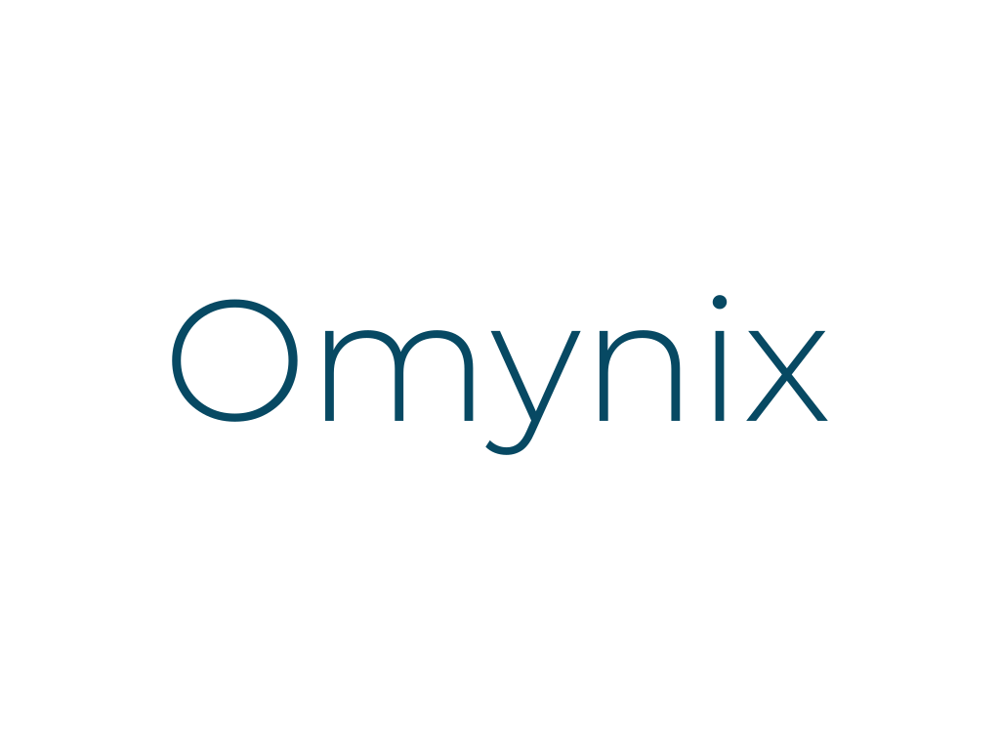

  

<h3 align="center">One panel for all your Linux servers.</h3>

  <b>Status: coming soon.</b> The open source code is not published yet.

---

## What is Omynix?

Omynix is an all-in-one control panel for people who run more than one Linux server. Install a small agent on each machine, connect it to your Omynix dashboard, and manage your whole fleet from one place: no more juggling SSH sessions, scattered scripts and half-forgotten cron jobs.

## What you get

- **Fleet overview**: every server at a glance, with live heartbeat and health status.
- **Metrics and alerts**: CPU, memory, disk and network history, with notifications by email, ntfy, Gotify or Discord.
- **Docker management**: list, start, stop and restart containers, read logs, and see when images have updates.
- **Shield**: a per-server prevention engine that detects attacks from your logs, blocks them with nftables, uses threat feeds, and watches for tampered files.
- **Backups**: scheduled, encrypted backups to S3, SFTP or local storage, with verification.
- **Domains and SSL**: certificate monitoring across your fleet, with warnings before anything expires.
- **Secure by design**: outbound-only agent connections, signed challenge-response enrollment, two-factor login and role-based access.

## What will be open source?

This repository will hold the parts that run on **your** machines, so you can read, audit and trust them:

| Component | What it does | Open source |
|---|---|---|
| **Omynix Agent** | Runs on each server, reports metrics, executes actions | Yes, coming soon |
| **Omynix Shield** | Intrusion prevention and file integrity monitoring | Yes, coming soon |
| Dashboard and portal | The web interface, hosted and operated by Omynix | No (hosted service) |

The dashboard is offered as a hosted service, so there is nothing to host yourself: you install the agent and sign in.

## Roadmap

- [x] Working agent, Shield and dashboard in private development
- [ ] Public repository with the Agent and Shield source code
- [ ] Documentation and install guide
- [ ] Open beta of the hosted dashboard
- [ ] License and contribution guidelines

## Stay in the loop

Watch or star this repository to be notified when the code lands.

## License

The license will be announced together with the first source release.

---

Built by <a href="https://github.com/Kaylenstr">Kay</a>.

